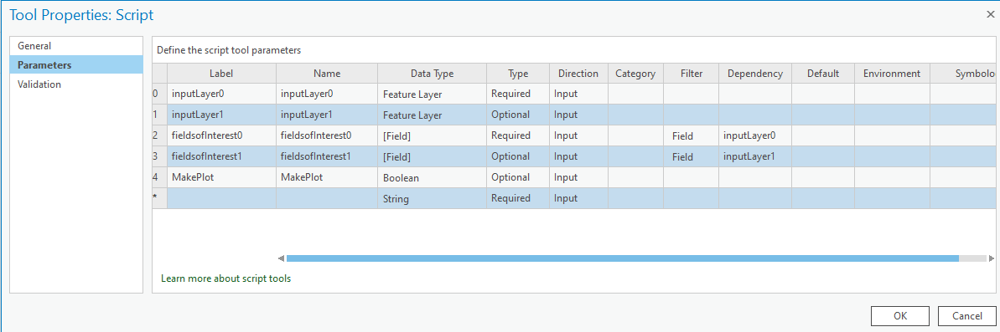

# ArcStat (5223 Final Project)  

Final project for 5223 from the group Wild Skipping Giraffes.

# Idea

Make a arcgis script that can calculate different statistics and analytics from a user supplied file.

# Libraries
* arcpy
* matplotlib
* numpy
* pandas
* seaborn

# Release 1

## Basic interface and function

Descriptive stats  
Correlation for multiple feilds  
Basic user interface  
User Manual

# Fields


# User Manual
### Installation  
Run ```python -m pip install -r requirements.txt```  
This should solve any "ModuleNotFoundError: No module named X" errors  

Installation instructions are under the "Using geoprocessing packages" heading in this material from OSU GEOG 5223.
[link to docs](/misc_assets/script-tools.html)

The gpkx file finalv*.gpkx in this repo is the package for our tools ArcStat

### Usage  
So far Arcstat will do different analysis depending on how many columns are selected.  
***If*** one column is selected, descriptive statistics will be printed.  
***If*** 2 fields are given correlation stats will be printed.  
***If*** greater than two fields are given the correlation statistics will be printed.  
***If*** the \"MakePlot\" check box is checked a matplotlib graph will be shown for 2 fields and a correlation heatmap if greater than 2 fields are given.  

# Vision Statement
***For*** ArgGIS Pro users

***Who*** need to analyze data and find many different descriptive statistics and correlations between multiple data sources  

***The*** ArcStat plugin is a tool

***That*** need to analyze data and find many different descriptive statistics and correlations between multiple data sources  

***Unlike*** individual analysis tools in the ArcGIS built-in toolboxes

***Our product*** provides all these statistical analysis in one place in an intuitive way that can output information to the user or to formats that can be used in other tools.


# Release Plan  
[Link To Release Plan xlsx](/misc_assets/Giraffes_Agile.xlsx)  

### Product backlog  
#### Implemented features  
todo
#### Soon to be implemented features  
todo
